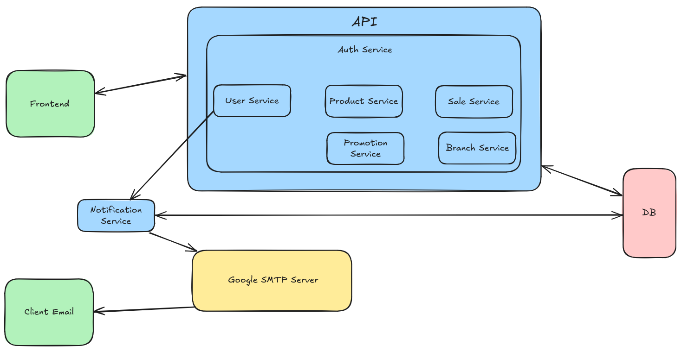

# Design de Sistema

Este documento descreve a arquitetura de alto nível da aplicação **PharmaWeave**.

## Camadas da Arquitetura

### 1. Frontend

- Interface web utilizada por **administradores, gerentes e funcionários**.  
- Comunica-se diretamente com a **API** para realizar operações como gestão de produtos, vendas, promoções e administração de unidades.  

### 2. API

- Camada central que concentra a **lógica de negócio** do sistema.  
- Conectada ao **banco de dados** para persistência das informações.  
- Expõe endpoints REST para o frontend.  

**Principais Serviços:**

- **Auth Service**: autenticação e controle de acesso.  
- **User Service**: gerenciamento de usuários (administradores, gerentes, funcionários e clientes).  
- **Product Service**: criação, atualização e controle de estoque de produtos.  
- **Sale Service**: registro e controle de vendas.  
- **Promotion Service**: criação e gerenciamento de promoções.  
- **Branch Service**: registro e gerenciamento de unidades (filiais).

### 3. Notification Service

- Consumidor da fila BullMQ que realiza integração com o Google SMTP Server para envio de emails.  

### 4. Google SMTP Server

- Responsável pelo **processamento de emails**.  

**Fluxo de Trabalho:**

1. O **User Service** envia mensagens para a fila **BullMQ**.
2. O **Notification Service** consome a fila, processa cada ação e envia para o **Google SMTP Server**.  
3. O **Google SMTP Server** envia o e-mail de início para o funcionário.
